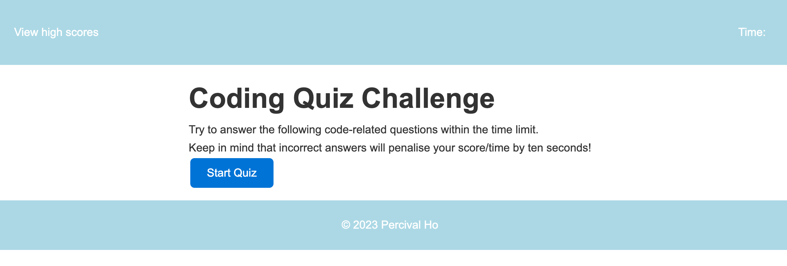
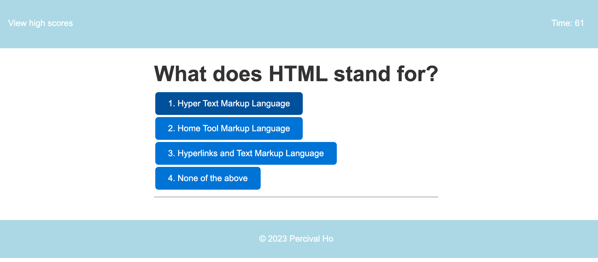
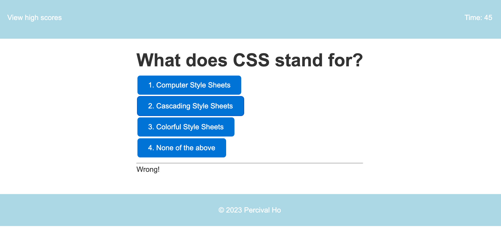
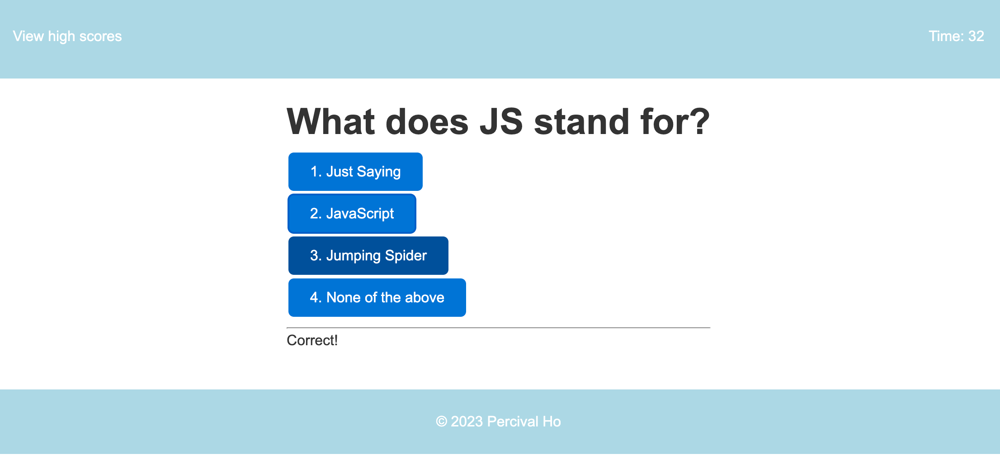
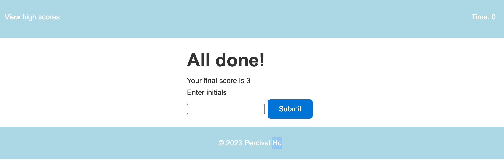
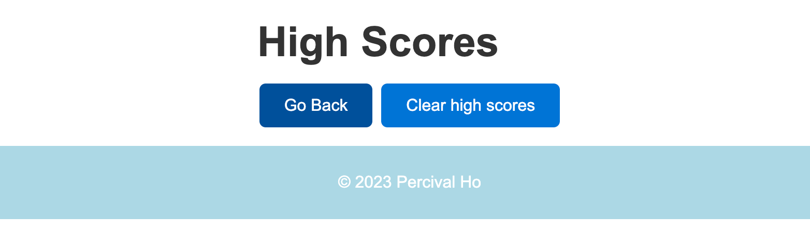

# Week4-Coding-Quiz-Challenge

## 04 Web APIs: Code Quiz

This Challenge invites you to build a timed coding quiz with multiple-choice questions. This app will run in the browser and will feature dynamically updated HTML and CSS powered by JavaScript code that you write. It will have a clean, polished, and responsive user interface. 

## User Story

```
AS A coding boot camp student
I WANT to take a timed quiz on JavaScript fundamentals that stores high scores
SO THAT I can gauge my progress compared to my peers
```

## Acceptance Criteria

```
GIVEN I am taking a code quiz
WHEN I click the start button
THEN a timer starts and I am presented with a question
WHEN I answer a question
THEN I am presented with another question
WHEN I answer a question incorrectly
THEN time is subtracted from the clock
WHEN all questions are answered or the timer reaches 0
THEN the game is over
WHEN the game is over
THEN I can save my initials and my score
```


## Usage

open index.html in Google Chrome (recommended), the Coding Quiz is shown as below:



On pressing the button "Start Quiz", 

Timer starts and then questions display for user to answer. 



on hover the answer, the button will be in darker color
when wrong answer is chosen, 'Wrong!' will be shown on the status bar with the next question



when correct answer is chosen, 'Correct!' will be shown on the status bar with the next question.



On Times up, or all questions have been answered, the total score will be shown up



On clicking the view high scores link on the top left corner,


the scores are stored in localStorage, so on clicking the clear score, the scores will be cleared



On clicking the button 'Go Back', it goes back to the Coding Quiz Start Page.

## Features

it includes the following features:

1.  On clicking 'Start Quiz', timer starts and presented with questions
2.  On answering the question by clicking the answers buttons, it shows Correct on status bar with next question when answered correct
3.  it shows Wrong on status bar with next questions and time is subtracted from the clock on answer incorrectly.
4.  when all questions answered or timer reaches 0, the results page will be shown.
5.  Initials can be inputted and store the score to localStorage.
6.  On clicking the link 'View high score', the high score list is shown (retrieved from localStorage).
7.  On clicking the 'Clear Scores', all scores cleared from localStorage.
8.  On clicking 'Go Back', the start page shows up.


## Tests

Testing done on:

1. testing on 'View High Scores' link.
2. testing on 'Start Quiz' button.
3. testing on Timer display.
4. testing on Questions display
5. testing on mouse hover on answer buttons.
6. testing on display status on answer wrong.
7. testing on display status on answer correct.
8. testing on displaying remaining time on top right corner.
9. testing on times up, on Finish page.
10. testing on answer all questions, on Finish page.
11. testing on input initials and submit
12. testing on appending the input to localStorage
13. testing on View High scores and shown the initials and scores out.
14. testing on Clear high scores.
15. testing on go back to start quiz again.


## Resources

Link to Deployed Website:
https://percivalho.github.io/Week3-Password-Generator/

Link to GitHub repo:
https://github.com/percivalho/Week3-Password-Generator.git


## License 


## Credits and Copyright 
&copy; Copyright 2023 - Present. Percival Ho